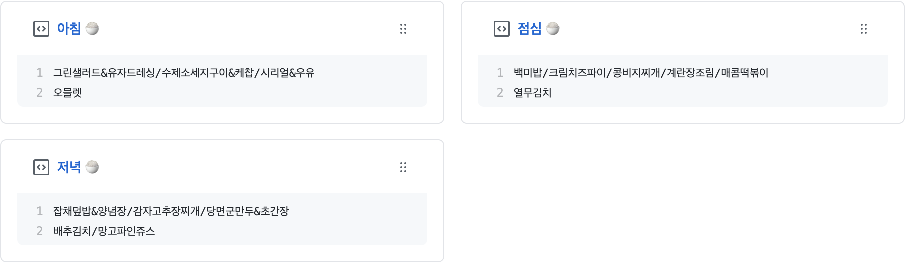

    
  <h3 align="center">📌✨오늘의 급식</h3>

   
   
   
   

   여러분의 오늘의 급식은 무엇인가요?
    
   오늘은 조식, 중식, 석식 중 언제가 맛있을까요?
    
   Let's check out in gist!

---

> This project is inspired by an pinned-gist. 
> Find original in https://github.com/craftydragon678 
> This README is made by referring to [this.](https://github.com/techinpark/productive-box/README.md)

## Overview

This project uses [@octokit/rest API](https://github.com/octokit/rest.js/)to write into the gist.

## Setup

### Prep work

1. Create a new public GitHub Gist (https://gist.github.com/)
1. Create a token with the `gist` scope and copy it. (https://github.com/settings/tokens/new)
   > enable only `gist` 

### Project setup

1. Fork this repo
1. Open the "Actions" tab of your fork and click the "enable" button
1. Edit the [environment variable](https://github.com/maxam2017/productive-box/blob/master/.github/workflows/schedule.yml#L17-L18) in `.github/workflows/schedule.yaml`:

   - **GIST_ID:** The ID portion from your gist url: `https://gist.github.com/woochanleee/`**`https://gist.github.com/woochanleee/fcdc51abe32b2ccf38b74f7229571da2`**.

1. Go to the repo **Settings > Secrets**
1. Add the following environment variables:
   - **GH_TOKEN:** The GitHub token generated above.
1. [Pin the newly created Gist](https://help.github.com/en/github/setting-up-and-managing-your-github-profile/pinning-items-to-your-profile)
